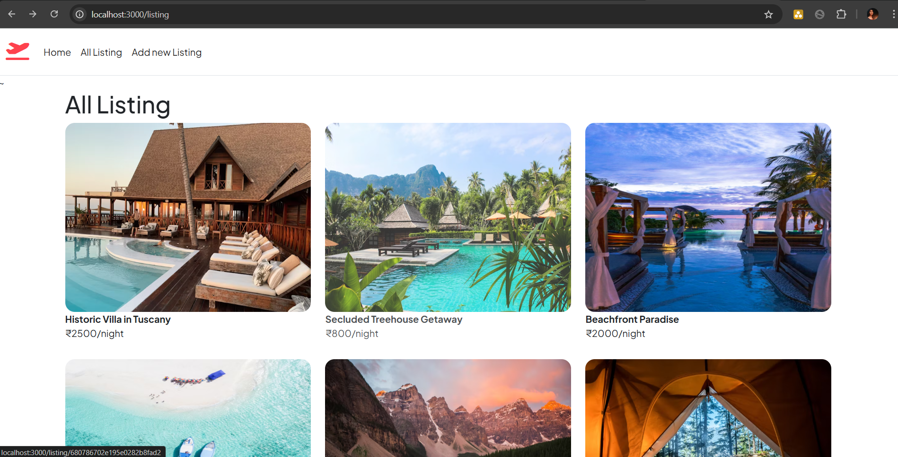
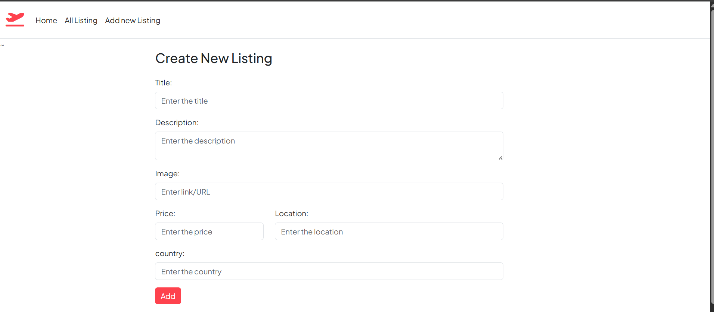
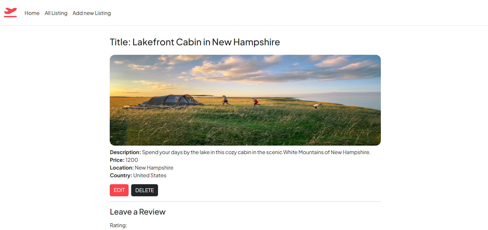
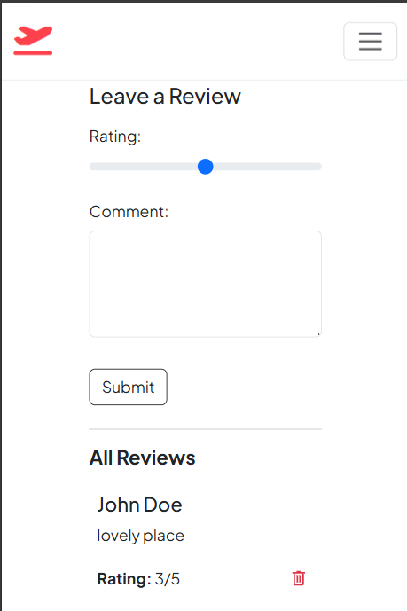

# 🌍 Travelo

**Travelo** is a dynamic travel booking platform built using **Express.js**, **EJS**, **Bootstrap**, and **MongoDB**. It allows users to explore destinations and book travel spots with a responsive and intuitive interface.

## ✨ Features

- 🗺️ Browse travel destinations with images and pricing
- 🛠️ Built with modular EJS templates for easy scalability
- 🎨 Responsive design using Bootstrap 5
- 💾 MongoDB integration for storing travel data
- 📝 Form validation using Joi
- 🔁 Method override support for RESTful routing

## 🛠️ Tech Stack

- **Backend:** Express.js
- **Templating Engine:** EJS with EJS-mate
- **Styling:** Bootstrap
- **Database:** MongoDB with Mongoose
- **Validation:** Joi
- **Routing:** Method-Override

## 🚀 Installation

### Dependancies 
```
npm i express
npm i ejs
npm i mongoose
npm i joi
npm i method-override

```

### Running project 

1. **Clone the repository:**
   ```
   git clone https://github.com/AlinaPathan/Travelo.git
    ```
2. **Navigate to project folder**
   ```
   cd Travelo
   ```
3. **Start the Server**
 ```
 node app.js 
 ```
4.  **Go to browser**
```
localhost:3000/listing

```

## Output 
1.  

2.  

3. 

4. 


### License

This project is licensed under the ISC License.

